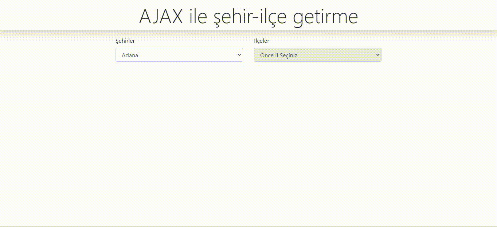

# Seçilen ile göre ilçelerinin getirilmesi
---
## AJAX ile JSON dosyasına XmlHttpRequest ile istek atıp verileri asenkron olarak çekiyoruz.
###### JSON'dan gelen verilerin içerisinde şehirlerin bulunduğu "cities" dizisine erişip bu verileri forEach ile her bir objenin isim ve id alanını  selectin içerisine aktaracağımız option etiketinin value ve name kısımlarına aktarıyoruz. Daha sonra bu htmli selectin içerisine aktarıyoruz.
---
## Şehir Selectinde bir değişiklik olduğunda seçilen verinin value değeri yani şehrin plakası, ilçeleri getirecek metot olan GetDistricts'e parametre olarak yolluyoruz.
###### Şehirleri getirirken yaptığımız gibi asenkron olarak istek atıp JSON'daki verileri çekiyoruz. Gelen verilerde ilçelerin bulunduğu "districts" dizisine bir filtrelemeyle seçili ilin ilçe verilerini getiriyoruz. Bu filtrelemede parametre olarak gelen plaka bilgisinin ilçeler arasında cityId'sine eşit olanları seç diyoruz. Bundan sonraki kısım aynıdır. bir html oluşturup bu htmli ilçe selectine gönderiyoruz.
---
### Her bir istek başarılı olup olmadığı kontrol edilmektedir. Eğer başarılı bir şekilde istek tamamlanıp veriler çekildiyse işlemlerimizi yapıyoruz. Başlangıçta İlçe selecti içi boş olduğundan disabled haldedir. İl plakası geldiğinde filtreleme ile verilerimizi çekip ilçe selectine aktardığımızda disabled özelliğini kaldırıyoruz. 
##### Script dosyasının 56. satırında opsiyonel olarak ilçe seçildikten sonra verileri ekrana yazdırıyorum.
---

### Uygulamaya ait örnek görüntü aşağıdaki gibidir.
---

### LICENSE
---
[MIT](https://choosealicense.com/licenses/mit/)